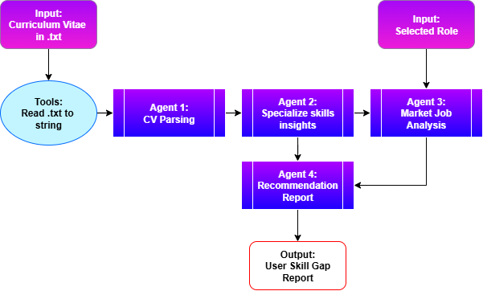

# AI-Powered-Skill-Gap-Analysis

## Project Objective
The purpose of this project is to implement a multi-agent system that processes user CVs and generates a personalized skill-gap analysis. Specifically, the AI agents will:
1. Identify the candidate’s explicit and implicit skills.
2. Retrieve insights on current job market demands.
3. Compare the candidate’s skills against market requirements.
4. Produce a skill-gap analysis with actionable feedback on missing or underdeveloped skills.
   
This system enables recruiters to uncover a candidate’s true potential and streamline the evaluation of large volumes of CVs, ultimately improving the recruitment process and decision-making efficiency.

## Architectural overview

This project leverages a hierarchical multi-agent architecture consisting of four AI agents and one tool. The framework is built using LangGraph and powered by Google Gemini 2.0 Flash Lite as the underlying LLM model.
In the hierarchical workflow, each AI agent has a specific role as follows:

### 1. Tools 1 - Read node
This tool transforms the candidate’s CV into a readable string format for further processing.

### 2. Agent 1 - CV Parsing
This agent extracts key candidate information from the CV with the support of the LLM. The output includes the candidate’s summary, job experience, skills, education, and projects.

### 3. Agent 2 - Skills Specialization
This agent processes the output from Agent 1 to generate a detailed breakdown of the candidate’s explicit and implicit skills:
1. Explicit skills: Directly mentioned in the CV.
2. Implicit skills: Inferred by the LLM from the candidate’s summary, experience, education, and projects.

The LLM also provides justification to support the inferred skills, helping recruiters validate the results.

### 4. Agent 3 - Job Market Analysis
In this step, the user specifies the target role for skill comparison. Using LLM capabilities combined with Google web search grounding, the agent identifies:
1. Current job requirements
2. In-demand skills
3. Relevant technologies for the selected role

### 5. Agent 4 - Recommendation report
This agent compares the candidate’s skills (from Agents 1 and 2) with the job market demands (from Agent 3). It generates a skill-gap analysis, highlights key strengths, and provides a development plan to enhance the candidate’s capabilities.

The final output is delivered as a markdown report, giving recruiters a clear and structured view of the candidate’s potential.

## Technical Requirements
Attached are the technical requirements needed to run this project:
1. Multi-AI Agent Frameworks: LangGraph
2. Programming Language: Python
3. LLM: Google Gemini 2.0 Flash Lite
4. Web search tools: Google Gemini Grounding Search

## Setup Environment and Install Dependencies

### 1. Create a virtual environment
```bash
python -m venv venv
```

### 2. Activate the virtual environment
#### Windows (Powershell)
```bash
.\venv\Scripts\activate
```

#### MacOS/Linux
```bash
source venv/bin/activate
```

### 3. Install dependencies
```bash
pip install -r requirements.txt
```

### 4. Create an environment.env file and store the Gemini API key
```bash
GEMINI_API_KEY="your_api_key_here"
```

## How to run the Application
### 1. Start the Streamlit application
Launch the Streamlit frontend to begin the analysis.
```bash
python -m streamlit run streamlit_app.py
```

### 2. Open the local URL
By default, Streamlit runs at:
```bash
http://localhost:8501
```

### 3. Upload your CV and fill the role
Prepare your CV in .txt format. Use the Upload File button in the web app to upload it.

Then, enter the target role you want to analyze (e.g., Data Scientist, Software Engineer).

### 4. Start the analysis
Click Analyze to process your CV against the selected role using job market insights.

### 5. Final report result
Each agent’s results will be displayed in Streamlit.
A comprehensive final report can be downloaded, providing clear insights into your skill-gap analysis and overall candidate profile.
